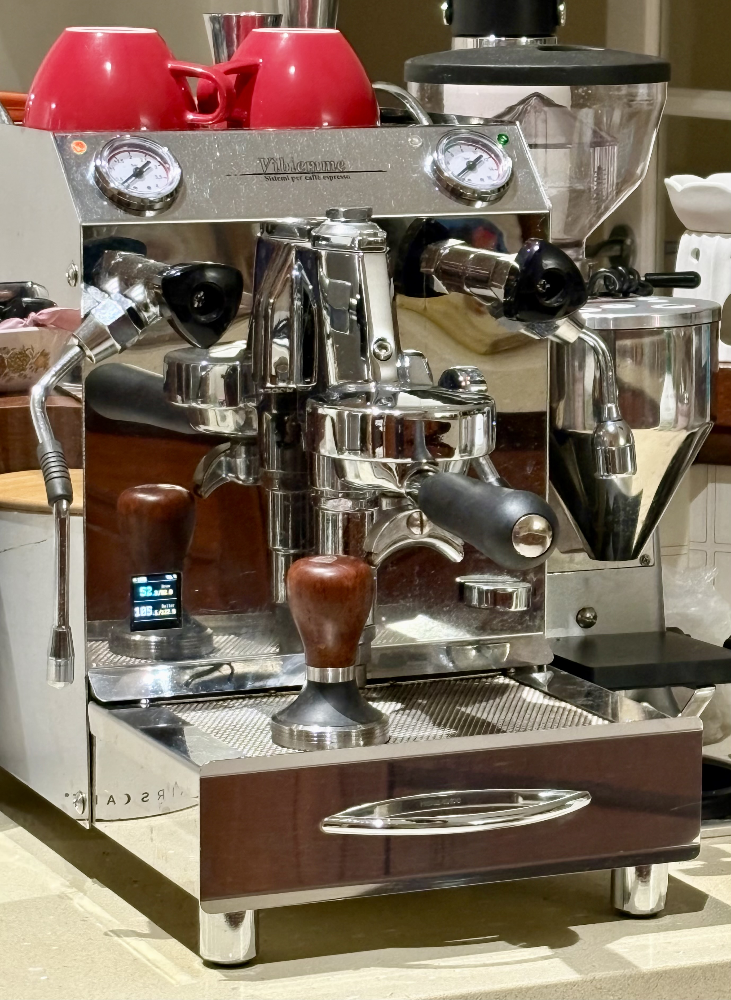
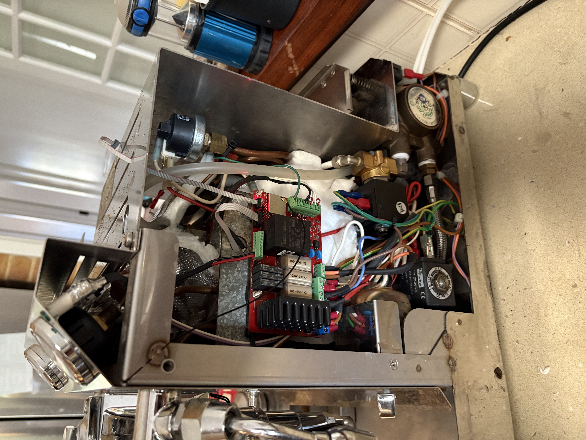
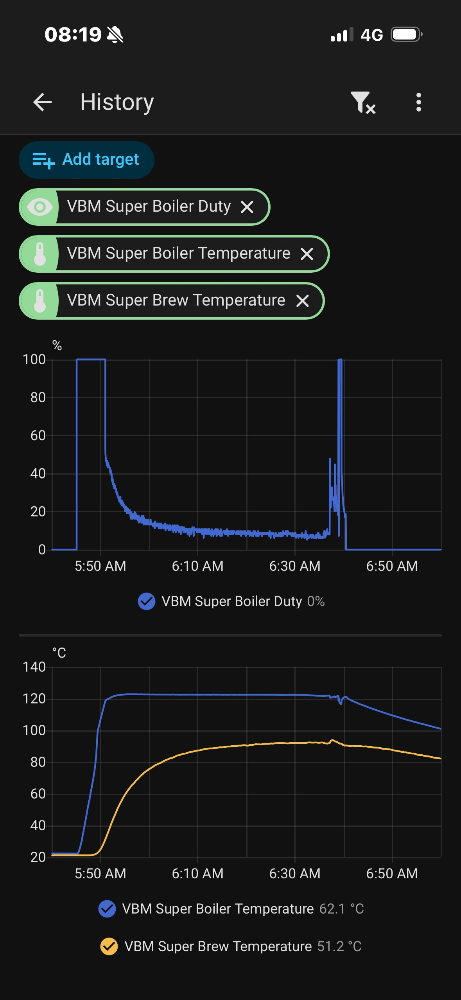
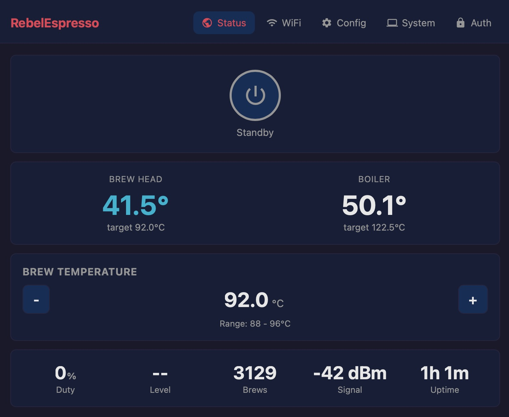

# RebelEspresso Firmware

[](https://github.com/lerebel103/RebelEspresso-firmware/actions/workflows/ci.yaml)
[](https://github.com/lerebel103/RebelEspresso-firmware/releases)
[](LICENSE)
[](https://www.espressif.com/en/products/socs/esp32)
[](https://github.com/espressif/esp-idf)
[](https://www.apple.com/home-app/)


Custom firmware for a double-PID control board for my Vibiemme Super machine.

The goal is to bring modern connectivity and control to a classic espresso machine:
- State-of-the-art temperature control for both boiler and brew head.
- Remote monitoring and control over WiFi.
- External control of brew-head setpoint.

## What It Does

- Runs on a complete custom PCB built around an ESP32.
- Exposes the electrical interfaces required to safely drive an SSR and interact with the machine as a full control system.
- Dual temperature loops (boiler + brew head).
- Embedded web app for status, configuration, OTA updates, and auth.
- Full Home Assistant / MQTT integration for remote observability and control.
- Apple HomeKit integration for native iOS/Home app control and Siri voice commands.
- Captive-portal WiFi provisioning (no mobile app required).

## Project In Practice

### Vibiemme Super + controller retrofit



This is the machine this project targets: a Vibiemme Super upgraded with a custom
ESP32 control stack. The firmware reads boiler and brew-head temperature sensors,
runs dedicated PID loops, and drives heaters/actuators through a safety-gated
output layer.

### Inside the machine: custom control board



The custom board is where the firmware's real-time control runs. In operation,
the system continuously:
- samples temperatures and water-level state,
- computes boiler and brew-head control effort,
- applies outputs through safety interlocks,
- publishes telemetry and accepts remote setpoint commands over WiFi/MQTT.

This architecture allows external brew-head setpoint control while keeping local
safety and deterministic temperature control on-device.

### Home Assistant telemetry



This capture shows the control behavior in practice:
- Boiler duty (%) ramps hard at startup, then tapers as the system approaches thermal steady state.
- Boiler temperature reaches and holds its target quickly.
- Brew-head temperature rises more gradually due to thermal mass and pipework coupling.

The reason for the dual PID architecture is that the brew head cannot be heated independently — it is coupled to the boiler through a thermosyphon, the passive heat-exchange loop common to E61 group machines like the VBM Super. To hold the brew head at its own target, the boiler setpoint is continuously trimmed up or down so that the resulting thermosyphon flow maintains the brew-head temperature. In this capture the boiler setpoint happens to be stable because thermal equilibrium was already reached before recording started.

### Built-in web interface



The web interface is hosted directly by the firmware and gives a live view of:
- machine state (power/standby),
- boiler and brew-head temperatures versus setpoints,
- brew setpoint controls,
- runtime counters and connectivity health.

## Quick Start

Prerequisites:
- [Docker](https://docs.docker.com/get-docker/)
- `make`
- `esptool` (for flashing and monitoring)

```bash
make setup      # one-time setup (submodules + Docker image + hooks)
make build      # build firmware and embedded web app
make test       # run unit tests in QEMU
make flash      # flash device
make monitor    # serial monitor
```

## Release Artifacts

Each release publishes:
- `deploy.zip` (full deploy bundle)
- direct firmware `.bin` file for quick OTA/manual flashing

## Development Notes

- Web UI source is in `webapp/index.html` and is embedded into firmware at build time.
- Main firmware logic is under `components/rebel-espresso/src`.
